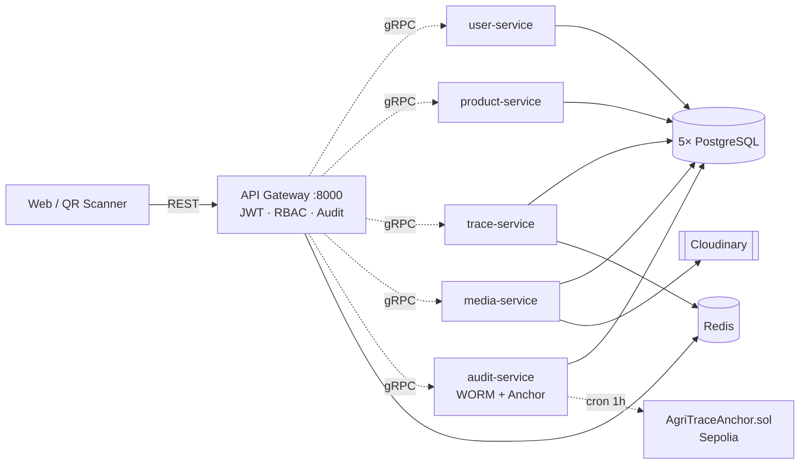

<div align="center">

# AgriTrace

**Hệ thống truy xuất nguồn gốc nông sản — chữ ký số RSA + neo bằng chứng lên Ethereum.**


</div>

---

## Giới thiệu

**AgriTrace** là nền tảng truy xuất nguồn gốc nông sản đầu–cuối, xây dựng cho đề tài tốt nghiệp. Nông dân ghi nhật ký canh tác, kiểm định viên ký số kết quả bằng RSA-2048, mọi biến động dữ liệu được khoá vào audit log WORM (hash chain) và mỗi giờ Merkle root được neo lên **Ethereum Sepolia** — bất kỳ ai cũng độc lập verify được dữ liệu chưa bị tampering.

Người tiêu dùng quét **QR trên bao bì** để xem trace công khai (không cần đăng nhập, không cần tin server).

Hệ thống phục vụ 4 nhóm người dùng: **Admin** (quản trị, duyệt chứng nhận, giám sát audit), **Farmer** (nông trại, lô, nhật ký, ký số), **Inspector** (kiểm định, ký số kết quả), **Consumer** (quét QR truy xuất).

---

## Điểm nổi bật

- **Chữ ký số client-side** — Private key RSA-2048 sinh tại server (trả 1 lần), lưu IndexedDB browser, ký bằng Web Crypto API. Server không bao giờ thấy private key.
- **Audit log bất biến** — Mọi action ghi qua decorator `@Auditable`, lưu thành hash chain với Postgres trigger WORM (chặn DELETE/UPDATE). Mỗi giờ Merkle root anchor lên Sepolia → tampering bị phát hiện ngay cả khi attacker chiếm DB.
- **Microservices gRPC** — 6 NestJS app (1 gateway + 5 service), database-per-service, Protobuf giữa các service nội bộ, REST giữa client và gateway.

---

## Kiến trúc



| Service | HTTP | gRPC | Vai trò | Database |
|---|:---:|:---:|---|---|
| **api-gateway** | 8000 | — | JWT, RBAC, throttle, AuditableInterceptor | — |
| **user-service** | 3001 | 50051 | Users, JWT key rotation, RSA keys | `agritrace_users` (5433) |
| **product-service** | 3002 | 50052 | Farms, Batches, certification, QR | `agritrace_products` (5434) |
| **trace-service** | 3003 | 50053 | ActivityLogs, Inspections, public trace | `agritrace_traces` (5435) |
| **media-service** | 3004 | 50054 | Cloudinary upload | `agritrace_media` (5436) |
| **audit-service** | 3005 | 50055 | WORM hash chain + Merkle Anchor cron | `agritrace_audit` (5437) |

---

## Tech stack

| Backend | Frontend | Hạ tầng & Blockchain |
|---|---|---|
| NestJS 11 + TypeScript 5.7 | Next.js 16.2 (App Router) | PostgreSQL 16 × 5 |
| TypeORM 0.3 | React 19.2 | Redis 7 |
| @grpc/grpc-js + Protobuf | Tailwind 4 + shadcn/ui | Cloudinary CDN |
| Passport JWT + bcrypt | Zustand 5 + React Query 5 | Docker Compose |
| @nestjs/throttler + Redis | react-hook-form + Zod | Solidity 0.8.24 + Hardhat 2.22 |
| Socket.io (notifications) | Web Crypto API (RSA sign) | ethers v6 + merkletreejs |
| @nestjs/schedule (cron) | Recharts, sonner, lucide | Ethereum Sepolia testnet |

---

## Cấu trúc thư mục

```
AgriTrace System/
├── backend/
│   ├── apps/                  # 6 NestJS apps: api-gateway, user-, product-,
│   │                          #                trace-, media-, audit-service
│   ├── contracts/             # Hardhat: AgriTraceAnchor.sol + deploy scripts
│   ├── libs/shared/           # proto/, abi/, enums, redis, blockchain helper
│   ├── seeds/                 # Seed users / products / traces
│   └── package.json
├── frontend/
│   ├── app/(app)/             # Dashboard có auth: farms, batches, audit, …
│   ├── app/(public)/          # Trang QR trace công khai
│   ├── components/            # UI (Radix + shadcn)
│   ├── hooks/ lib/ stores/    # Logic, API client, crypto, Zustand
│   └── package.json
├── docker-compose.yml         # 5 PostgreSQL + Redis
└── README.md
```

---

## Setup nhanh

**Yêu cầu**: Node.js ≥ 20, npm ≥ 10, Docker Desktop, tài khoản Cloudinary (free).

### 1. Clone & cài deps

```bash
git clone <repo-url>
cd "AgriTrace System"
cd backend && npm install
cd ../frontend && npm install
```

### 2. Cấu hình `.env`

Tạo `backend/.env` (xem file mẫu trong repo cho danh sách đầy đủ — JWT secret, 5 cụm DB credentials, Redis, Cloudinary). Tạo `frontend/.env.local`:

```env
NEXT_PUBLIC_API_URL=http://localhost:8000
```

### 3. Bật hạ tầng

```bash
cd backend
npm run start:db        # 5 Postgres + Redis qua docker-compose
```

### 4. Seed dữ liệu

```bash
npm run seed:fresh      # Wipe + seed admin/farmer/inspector + farms/batches
```

### 5. Chạy backend + frontend

```bash
# Terminal 1 — 6 service song song
npm run start:dev:all

# Terminal 2
cd frontend && npm run dev
```

Truy cập: **Web** http://localhost:3000 · **API** http://localhost:8000

---

## Tài khoản demo

| Vai trò | Email | Password |
|---|---|---|
| Admin | `admin@gmail.com` | `Adminpassword` env |
| Farmer | `farmer1@gmail.com` … `farmer3@gmail.com` | `userpassword` env |
| Inspector | `inspector1@gmail.com` · `inspector2@gmail.com` | `userpassword` env |

---

## Smart contract (tuỳ chọn)

Phần blockchain anchor **không bắt buộc** để chạy hệ thống — audit-service vẫn hoạt động ở chế độ off-chain. Nếu muốn bật anchor lên Sepolia:

```bash
cd backend/contracts
npm install
cp .env.example .env    # set SEPOLIA_RPC_URL + DEPLOYER_PRIVATE_KEY
npm run test            # 12 test cases local
npm run deploy:sepolia  # in ra contract address
npm run export-abi      # copy ABI sang libs/shared/abi/
```

Sau đó set `ANCHOR_RPC_URL`, `ANCHOR_PRIVATE_KEY`, `ANCHOR_CONTRACT_ADDRESS`, `ANCHOR_CRON=0 * * * *` trong `backend/.env` rồi restart audit-service. Faucet ETH Sepolia: <https://sepolia-faucet.pk910.de/>.

Contract đã deploy: [`0xE777C423eafaa029c743f67B7e86999FD6bC86f9`](https://sepolia.etherscan.io/address/0xE777C423eafaa029c743f67B7e86999FD6bC86f9) (Sepolia, chainId 11155111).

---

## Scripts hữu ích

| Lệnh | Vị trí | Mô tả |
|---|---|---|
| `npm run dev` | `backend/` | Bật DB + 6 service song song |
| `npm run start:dev:all` | `backend/` | Chạy 6 service (DB phải sẵn) |
| `npm run start:db` / `stop:db` | `backend/` | docker compose up/down |
| `npm run seed:fresh` | `backend/` | Wipe DB + seed lại |
| `npm run test` | `backend/` | Jest unit + E2E |
| `npm run deploy:sepolia` | `backend/contracts/` | Deploy smart contract |
| `npm run dev` | `frontend/` | Next.js dev server (port 3000) |
| `npm run build` | `frontend/` | Build production |

---

## Demo flow (5 phút)

1. **CRUD + audit** — Login admin, tạo/sửa farm → mở `/audit` → 2 dòng `FARM_CREATED`/`FARM_UPDATED` xuất hiện ngay, click row xem JSON diff.
2. **RSA sign** — Login farmer, tạo activity log "Bón phân", upload PEM ký → trang public `/trace/{batch_code}` hiện badge *"Đã xác thực RSA"*.
3. **WORM trigger** — `psql` chạy `DELETE FROM audit_logs` → trigger báo lỗi *"audit_logs is WORM"*.
4. **Tampering detection** — Disable trigger thủ công → UPDATE 1 dòng → trang `/audit/[seq]/verify` highlight đỏ ngay (hash chain phá vỡ).
5. **On-chain anchor** — Click *"Anchor ngay"* → 15-30s sau hiện tx hash Sepolia → mở Etherscan thấy event `AnchorStored` với Merkle root.

---

## Roadmap

- [ ] Public verify page — ai cũng verify được, không cần đăng nhập
- [ ] Mobile app React Native cho farmer ghi nhật ký ngoài đồng
- [ ] VietGAP / GlobalGAP checklist template
- [ ] Tích hợp IoT sensor (nhiệt độ kho lạnh) → tự động ghi audit
- [ ] Message broker (Kafka/RabbitMQ) thay 1 phần gRPC đồng bộ
- [ ] Multi-chain anchoring (Sepolia + Polygon Amoy + Arbitrum)
- [ ] Kubernetes deployment + CI/CD
- [ ] OpenAPI / Swagger docs

---

<div align="center">

**AgriTrace** · *Trồng sạch, bán minh bạch, ăn an tâm — và bất biến trên blockchain.*

</div>
