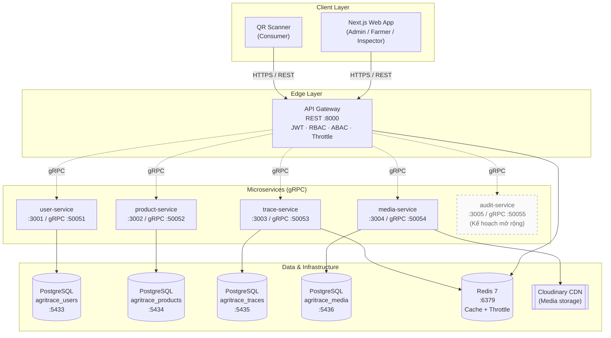

<div align="center">

# AgriTrace — Hệ thống Truy xuất Nguồn gốc Nông sản

**Nền tảng truy xuất nguồn gốc nông sản đầu–cuối, xây dựng trên kiến trúc Microservices.**


</div>

---

## Mục lục

1. [Giới thiệu](#1-giới-thiệu)
2. [Tính năng chính](#2-tính-năng-chính)
3. [Kiến trúc hệ thống](#3-kiến-trúc-hệ-thống)
4. [Công nghệ sử dụng](#4-công-nghệ-sử-dụng)
5. [Cấu trúc thư mục](#5-cấu-trúc-thư-mục)
6. [Yêu cầu hệ thống](#6-yêu-cầu-hệ-thống)
7. [Hướng dẫn cài đặt & chạy](#7-hướng-dẫn-cài-đặt--chạy)
8. [Biến môi trường](#8-biến-môi-trường)
9. [Scripts npm hữu ích](#9-scripts-npm-hữu-ích)
10. [Hướng phát triển](#10-hướng-phát-triển)

---

## 1. Giới thiệu

**AgriTrace** là hệ thống truy xuất nguồn gốc nông sản toàn trình, được xây dựng nhằm giải quyết bài toán **minh bạch chuỗi cung ứng nông nghiệp** tại Việt Nam. Nông dân ghi nhận quy trình canh tác theo thời gian thực, kiểm định viên xác thực chất lượng theo các tiêu chuẩn (VietGAP, Organic, GlobalGAP…), và người tiêu dùng có thể **quét mã QR** trên từng lô sản phẩm để xem đầy đủ xuất xứ, nhật ký canh tác và kết quả kiểm định.

Hệ thống phục vụ bốn nhóm đối tượng:

| Đối tượng | Vai trò |
|---|---|
| **Admin** | Quản trị hệ thống, người dùng, phân quyền, cấp API key, giám sát audit log |
| **Nông dân (Farmer)** | Quản lý nông trại, lô sản phẩm, ghi nhật ký canh tác, sinh mã QR |
| **Kiểm định viên (Inspector)** | Thực hiện đánh giá theo tiêu chuẩn, ghi nhận kết quả kiểm tra |
| **Người tiêu dùng** | Quét QR để tra cứu nguồn gốc, quy trình, kết quả kiểm định |

---

## 2. Tính năng chính

### Dành cho Nông dân
- Quản lý danh mục **nông trại** (Farm) với thông tin vị trí, chứng nhận.
- Tạo **lô sản phẩm** (Batch) gắn với loại cây trồng (Crop Category).
- Ghi **nhật ký canh tác** (Activity Logs): gieo trồng, tưới tiêu, bón phân, phun thuốc, thu hoạch…
- Tải lên hình ảnh minh hoạ cho nông trại / lô / hoạt động (lưu trên Cloudinary CDN).
- Sinh **mã QR** duy nhất cho mỗi lô — in trên bao bì để người tiêu dùng truy xuất.

### Dành cho Kiểm định viên
- Tiếp nhận yêu cầu kiểm định từ các lô sản phẩm.
- Thực hiện đánh giá theo các tiêu chuẩn chất lượng (VietGAP, Organic…).
- Ghi nhận kết quả **Inspection**: `PASS` / `FAIL` / `PENDING`, kèm ghi chú và ảnh chứng cứ.

### Dành cho Quản trị
- CRUD người dùng, gán vai trò (ADMIN / FARMER / INSPECTOR).
- Cấp / thu hồi **API Key** cho tích hợp bên thứ ba.
- Xem **audit log** (ai — lúc nào — thay đổi gì).
- Cấu hình hệ thống, quản lý tiêu chuẩn kiểm định.

### Dành cho Người tiêu dùng
- Quét QR trên bao bì bằng điện thoại.
- Xem công khai: thông tin nông trại, quy trình canh tác chi tiết theo mốc thời gian, kết quả kiểm định.
- Truy cập không cần đăng nhập, có cache Redis 60s để phản hồi tức thì.

---

## 3. Kiến trúc hệ thống

### Mô hình tổng quan

Hệ thống áp dụng kiến trúc **Microservices** với:
- **REST** cho giao tiếp giữa client và API Gateway.
- **gRPC + Protobuf** cho giao tiếp nội bộ giữa các service (độ trễ thấp, type-safe).
- **Database-per-Service**: mỗi service sở hữu một PostgreSQL riêng, độc lập schema.
- **Redis** làm lớp cache + rate limiting tập trung.
- **Cloudinary** làm kho lưu trữ và CDN cho media.



### Vai trò từng service

| Service | Port HTTP | Port gRPC | Trách nhiệm | Database |
|---|:---:|:---:|---|---|
| **api-gateway** | 8000 | — | Cổng vào duy nhất, xác thực JWT, phân quyền, rate limit, điều phối gRPC | — |
| **user-service** | 3001 | 50051 | Người dùng, hồ sơ, JWT key rotation, API key | `agritrace_users` |
| **product-service** | 3002 | 50052 | Nông trại, lô sản phẩm, danh mục cây trồng, sinh QR | `agritrace_products` |
| **trace-service** | 3003 | 50053 | Nhật ký canh tác, kiểm định, truy xuất theo QR | `agritrace_traces` |
| **media-service** | 3004 | 50054 | Quản lý asset, tích hợp Cloudinary | `agritrace_media` |
| **audit-service** *(kế hoạch)* | 3005 | 50055 | Tách audit log thành service độc lập | `agritrace_audit` |

> Lưu ý: `audit-service` hiện nằm dưới dạng module bên trong `api-gateway` và sẽ được tách thành microservice riêng ở giai đoạn tiếp theo.

---

## 4. Công nghệ sử dụng

### Backend

| Hạng mục | Công nghệ | Phiên bản | Vai trò |
|---|---|:---:|---|
| Framework | NestJS | 11 | Framework chính, monorepo mode |
| Ngôn ngữ | TypeScript | 5.7 | Type-safe toàn hệ thống |
| ORM | TypeORM | 0.3 | Mapping PostgreSQL, migration |
| RPC | @grpc/grpc-js + proto-loader | 1.14 / 0.8 | Giao tiếp nội bộ |
| Xác thực | Passport + passport-jwt | 0.7 / 4.0 | Chiến lược JWT |
| JWT | @nestjs/jwt | 11 | Sinh & xác thực token (access/refresh) |
| Hashing | bcrypt | 6 | Hash mật khẩu |
| Validation | class-validator · class-transformer | 0.15 / 0.5 | Kiểm tra DTO đầu vào |
| Cache / Throttle | ioredis · @nestjs/throttler | 5.10 / 6.5 | Redis-backed rate limiting |
| QR Code | qrcode | 1.5 | Sinh mã QR phía server |
| Media | cloudinary · multer | 2.9 / 1.4 | Upload ảnh |
| Scheduler | @nestjs/schedule | 6.1 | Cron task (key rotation…) |

### Frontend

| Hạng mục | Công nghệ | Phiên bản | Vai trò |
|---|---|:---:|---|
| Framework | Next.js | 16.2 | App Router, SSR/CSR |
| UI Runtime | React | 19.2 | Server Components |
| Styling | Tailwind CSS | 4 | Utility-first CSS |
| Component Library | Radix UI + shadcn | — | Primitive accessible components |
| State | Zustand | 5 | Client state store |
| Data Fetching | @tanstack/react-query | 5.96 | Cache + sync server state |
| Form | react-hook-form + Zod | 7.72 / 4.3 | Form + schema validation |
| Chart | Recharts | 3.8 | Dashboard biểu đồ |
| QR UI | qrcode.react | 4.2 | Hiển thị QR trên web |
| Theme | next-themes | 0.4 | Dark / Light mode |
| Icon | lucide-react · react-icons | — | Icon set |
| Notify | sonner | 2 | Toast notifications |

### Hạ tầng & DevOps

| Hạng mục | Công nghệ | Vai trò |
|---|---|---|
| Database | PostgreSQL 16 (× 4 instance) | Database-per-service |
| Cache | Redis 7 | Cache QR lookup + rate limit storage |
| Object Storage | Cloudinary | CDN ảnh |
| Container | Docker Compose | Orchestration local dev |
| Process Runner | concurrently | Chạy 5 service song song |
| Test | Jest + ts-jest · supertest | Unit + E2E |
| Code Quality | ESLint 9 · Prettier 3 | Lint + format |

---

## 5. Cấu trúc thư mục

```
AgriTrace System/
├── backend/
│   ├── apps/
│   │   ├── api-gateway/        # REST gateway, JWT/RBAC, throttle, audit
│   │   ├── user-service/       # Users, profiles, JWT key rotation, API key
│   │   ├── product-service/    # Farms, Batches, Crop Categories, QR generator
│   │   ├── trace-service/      # Activity Logs, Inspections, public trace
│   │   └── media-service/      # Cloudinary assets, upload pipeline
│   ├── libs/
│   │   └── shared/             # Proto, enums, types, Redis module dùng chung
│   ├── seeds/                  # Seed data (users, products, traces, media)
│   │   ├── user.seed.ts
│   │   ├── product.seed.ts
│   │   ├── trace.seed.ts
│   │   ├── asset.seed.ts
│   │   └── media/              # Ảnh mẫu cho seed
│   ├── nest-cli.json           # Cấu hình monorepo NestJS
│   └── package.json
├── frontend/
│   └── app/
│       ├── (app)/              # Layout có auth
│       │   ├── dashboard/      # 3 dashboard theo role
│       │   ├── farms/          # Quản lý nông trại
│       │   ├── batches/        # Quản lý lô sản phẩm + QR
│       │   ├── crops/          # Danh mục cây trồng
│       │   ├── users/          # Quản lý người dùng (Admin)
│       │   ├── keys/           # API keys
│       │   ├── standards/      # Tiêu chuẩn kiểm định
│       │   └── settings/       # Cấu hình
│       └── (public)/           # Trang công khai (trace theo QR)
├── worker/                     # Background worker (dự phòng)
├── docker-compose.yml          # 4 PostgreSQL + Redis
└── README.md
```

---

## 6. Yêu cầu hệ thống

| Công cụ | Phiên bản tối thiểu |
|---|---|
| Node.js | ≥ 20.x |
| npm | ≥ 10.x |
| Docker Desktop | ≥ 4.x (bao gồm Docker Compose v2) |
| Git | ≥ 2.x |
| Cloudinary | Tài khoản miễn phí (lấy `cloud_name`, `api_key`, `api_secret`) |

---

## 7. Hướng dẫn cài đặt & chạy

### Bước 1 — Clone mã nguồn và cài đặt dependency

```bash
git clone <repository-url>
cd "AgriTrace System"

# Cài đặt backend
cd backend
npm install

# Cài đặt frontend
cd ../frontend
npm install
```

### Bước 2 — Cấu hình biến môi trường

Tạo file `backend/.env` theo mẫu ở [Section 8](#8-biến-môi-trường).
Tạo file `frontend/.env.local` với tối thiểu:

```env
NEXT_PUBLIC_API_URL=http://localhost:8000
```

### Bước 3 — Khởi động hạ tầng (PostgreSQL × 4 + Redis)

```bash
cd backend
npm run start:db
```

Lệnh này gọi `docker compose up -d` từ root, tạo 5 container: `agritrace-user-db`, `agritrace-product-db`, `agritrace-trace-db`, `agritrace-media-db`, `agritrace-redis`.

### Bước 4 — Nạp dữ liệu mẫu (seeding)

```bash
npm run seed:fresh
```

Script sẽ xoá và tạo lại toàn bộ dữ liệu demo: 1 admin, 3 nông dân, 2 kiểm định viên, các nông trại, lô sản phẩm, nhật ký canh tác và kết quả kiểm định mẫu.

**Tài khoản demo sau khi seed:**

| Vai trò | Email | Mật khẩu |
|---|---|---|
| Admin | `admin@gmail.com` | lấy từ biến `Adminpassword` trong `.env` |
| Farmer | `farmer1@gmail.com` · `farmer2@gmail.com` · `farmer3@gmail.com` | lấy từ biến `userpassword` trong `.env` |
| Inspector | `inspector1@gmail.com` · `inspector2@gmail.com` | lấy từ biến `userpassword` trong `.env` |

> Xem chi tiết tại `backend/seeds/user.seed.ts`.

### Bước 5 — Chạy backend (5 service song song)

```bash
npm run start:dev:all
```

Bạn sẽ thấy log với 5 tiền tố màu: `GW` (API Gateway), `USER`, `PROD`, `TRACE`, `MEDIA`.

### Bước 6 — Chạy frontend (mở tab terminal mới)

```bash
cd frontend
npm run dev
```

### Bước 7 — Truy cập hệ thống

- Giao diện: **http://localhost:3000**
- API Gateway: **http://localhost:8000**

---

## 8. Biến môi trường

File `backend/.env` — tham khảo mẫu bên dưới, điền giá trị phù hợp với môi trường của bạn.

### Ports & URLs

| Biến | Mô tả | Giá trị mẫu |
|---|---|---|
| `PORT` | Cổng API Gateway | `8000` |
| `FRONTEND_URL` | CORS origin | `http://localhost:3000` |
| `USER_SERVICE_PORT` | HTTP port user-service | `3001` |
| `PRODUCT_SERVICE_PORT` | HTTP port product-service | `3002` |
| `TRACE_SERVICE_PORT` | HTTP port trace-service | `3003` |
| `MEDIA_SERVICE_PORT` | HTTP port media-service | `3004` |
| `USER_SERVICE_GRPC_URL` | Địa chỉ gRPC user-service | `localhost:50051` |
| `PRODUCT_SERVICE_GRPC_URL` | Địa chỉ gRPC product-service | `localhost:50052` |
| `TRACE_SERVICE_GRPC_URL` | Địa chỉ gRPC trace-service | `localhost:50053` |
| `MEDIA_GRPC_URL` | Địa chỉ gRPC media-service | `localhost:50054` |

### Database (4 database riêng biệt)

| Biến | Giá trị mẫu |
|---|---|
| `USER_DB_HOST` / `PORT` / `USER` / `PASS` / `NAME` | `localhost` / `5433` / `user_admin` / `user_pass123` / `agritrace_users` |
| `PRODUCT_DB_HOST` / `PORT` / `USER` / `PASS` / `NAME` | `localhost` / `5434` / `product_admin` / `product_pass123` / `agritrace_products` |
| `TRACE_DB_HOST` / `PORT` / `USER` / `PASS` / `NAME` | `localhost` / `5435` / `trace_admin` / `trace_pass123` / `agritrace_traces` |
| `MEDIA_DB_HOST` / `PORT` / `USER` / `PASS` / `NAME` | `localhost` / `5436` / `media_admin` / `media_pass123` / `agritrace_media` |

### JWT

| Biến | Mô tả | Giá trị mẫu |
|---|---|---|
| `JWT_ACCESS_SECRET` | Secret ký access token | chuỗi random ≥ 32 ký tự |
| `JWT_REFRESH_SECRET` | Secret ký refresh token | chuỗi random ≥ 32 ký tự |
| `JWT_ACCESS_EXPIRATION` | Thời hạn access token | `15m` |
| `JWT_REFRESH_EXPIRATION` | Thời hạn refresh token | `7d` |

### Redis & Rate Limiting

| Biến | Mô tả | Giá trị mẫu |
|---|---|---|
| `REDIS_HOST` | Host Redis | `localhost` |
| `REDIS_PORT` | Port Redis | `6379` |
| `RATE_LIMIT_TTL_MS` | Cửa sổ throttle (ms) | `60000` |
| `RATE_LIMIT_MAX` | Số request tối đa / cửa sổ | `100` |
| `QR_CACHE_TTL_SEC` | Thời gian cache truy xuất QR (giây) | `60` |

### Cloudinary & Seed password

| Biến | Mô tả |
|---|---|
| `CLOUDINARY_CLOUD_NAME` / `CLOUDINARY_API_KEY` / `CLOUDINARY_API_SECRET` | Thông tin tài khoản Cloudinary |
| `Adminpassword` | Mật khẩu admin dùng khi seed |
| `userpassword` | Mật khẩu mặc định cho farmer/inspector khi seed |

---

## 9. Scripts npm hữu ích

Chạy trong thư mục `backend/`:

| Lệnh | Mô tả |
|---|---|
| `npm run dev` | Bật DB + chạy 5 service song song |
| `npm run start:dev:all` | Chỉ chạy 5 service song song (DB phải sẵn) |
| `npm run start:api-gateway` | Chạy riêng API Gateway (watch mode) |
| `npm run start:user-service` | Chạy riêng user-service |
| `npm run start:product-service` | Chạy riêng product-service |
| `npm run start:trace-service` | Chạy riêng trace-service |
| `npm run start:media-service` | Chạy riêng media-service |
| `npm run start:db` | `docker compose up -d` (4 Postgres + Redis) |
| `npm run stop:db` | `docker compose down` |
| `npm run seed` | Seed dữ liệu mẫu (upsert, không xoá) |
| `npm run seed:fresh` | Xoá sạch rồi seed lại toàn bộ |
| `npm run seed:users` | Seed riêng người dùng |
| `npm run seed:products` | Seed riêng nông trại / lô / cây trồng |
| `npm run seed:traces` | Seed riêng nhật ký + kiểm định |
| `npm run build` | Biên dịch tất cả app (output `dist/`) |
| `npm run start:prod` | Chạy production từ `dist/` |
| `npm run test` · `test:cov` · `test:e2e` | Jest unit / coverage / E2E |
| `npm run lint` | ESLint + auto-fix |

Chạy trong thư mục `frontend/`:

| Lệnh | Mô tả |
|---|---|
| `npm run dev` | Next.js dev server (`http://localhost:3000`) |
| `npm run build` | Build production |
| `npm run start` | Chạy production server |
| `npm run lint` | ESLint |

---

## 10. Hướng phát triển

- [ ] Tách **audit-service** thành microservice độc lập (hiện nằm trong API Gateway).
- [ ] Tích hợp **Blockchain** (Hyperledger Fabric) để đảm bảo tính bất biến của chuỗi truy xuất.
- [ ] Ứng dụng **Mobile** (React Native) cho nông dân ghi nhật ký ngoài thực địa.
- [ ] Tiếp nhận dữ liệu **IoT sensor** (nhiệt độ, độ ẩm kho bảo quản).
- [ ] Thay thế một số luồng **gRPC đồng bộ** bằng **Kafka event bus** để tăng khả năng mở rộng.
- [ ] Tài liệu hoá API bằng **OpenAPI / Swagger** tại `/api/docs`.
- [ ] Pipeline **CI/CD** (GitHub Actions) + triển khai container hoá lên Kubernetes.

---

<div align="center">

**AgriTrace** — *Trồng sạch, bán minh bạch, ăn an tâm.*

</div>
